# Week 3 - A

## Recap

* View transform:
    * World coordinate is rendered as it appears in the camera's local coordiante frame.
    * The view transform converts the world coordinate frame into the camera's local coordinate frame
* Inverse transformations:
    * Local-to-global transformation is $Q = \textbf{M}_T\textbf{M}_R\textbf{M}_S\ P$
    * On the contrary, global-to-local transformation is $P = \textbf{M}_S^{-1}\textbf{M}_R^{-1}\textbf{M}_T^{-1}\ Q$
    * translation: $\textbf{M}_T^{-1}(d_x,d_y) = \textbf{M}_T(-d_x, -d_y)$
    * roatation: $\textbf{M}_R^{-1}(\theta) = \textbf{M}_R(-\theta)$
    * scale: $\textbf{M}_S^{-1}(s_x,s_y) = \textbf{M}_S(1/s_x,1/s_y)$
    * shear: $\textbf{M}_H^{-1}(h) = \textbf{M}_H(-h)$; however, this operation we don't do much.
* Reparenting of the scene tree
    * rotation: $r_{Table} + r_{Bottle}$
    * scale: $s_{Table} \times s_{Bottle}$
    * **translation**: is different from the first two, it dooes need to perform the global-to-local (calculating global coordinate first then the global coordinate should not be affected by reparenting) transformation first.

> If it really comes to the shear, check dot product of the matrices is equal to zero

## Lerping (Linear interpolation)

This is now the time affine transformation (homogenous vector) working on the addtion of two points (orginally, not working for addition for two points because of $1 + 1 = 2$). 

$$ \frac{1}{2}(p_1,p_2,1)^T + \frac{1}{2}(q_1,q_2,1)^T = (\frac{p_1+q_1}{2}, \frac{p_2,q_2}{2},1)^T $$

A naive derivation for the formula is firstly, a point adds to a vector results a new point. Based on $(v.x, v.y, 0)^T + (p.x, p.y, 1)^T = (x, y, 1)^T$, the result is clearly a point.

Linear interpolation
$$ lerp(P,Q,t) = P + t(Q-P) $$
$$ lerp(P,Q,t) = P(1-t) + tQ $$

#### Example

Using lienar interpolation, what is the midpoint between A=(4,9) and B=(3,7) <br>

As we are interested in midpoint, t is clearly $0,5$ here (half length of the line AB). By applying the formula mentioned above,
$$ lerp(A,B,0.5) = (4 + 0.5 * (3-4), 9 + 0.5 * (7-9)) $$
$$ midpoint = (3.5, 8) $$

#### Lines

* Parametric form:

$$ L(t) = P+t\textbf{v} $$
$$ \textbf{v} = Q - P $$
$$ L(t) = P + t(Q-P) $$


* Point-normal form in 2D:
$$ n \cdot (P - L) = 0 $$

#### Line intersection

* Two lines of parametric form
Two lines can be expressed by
$$ L_{AB}(t) = A + (B - A)t $$
$$ L_{CD}(u) = C + (D - C)u $$
Then their intersection can be calculated by
$$ L_{AB}(t) = L_{CD}(\textbf{u}) $$

* Two lines of parametric form and point-normal form

Two lines can be expressed by
$$ L_{AB} = A + \textbf{c}t $$
$$ L_{CD} = \textbf{n} \cdot (P-B) $$
$L_{CD}$ can then be converted into a form expressed in terms of x and y
$$ Ax + By + C = 0 $$
Finally, subustitute result of $L_{AB}$ into point-normal form, the resulting form is the intersection.

## Point in the polygon

It is of great importance to determine whether the point is in or out of the polygon when drawing the polygons.

* One simple way of finding whether the point is side or outside the a simple polygon is to test how many times a ray, starting from the point and going in the any fixed direction, intersects the edge of polygon.
  * If the point is outside the polygon, the ray will intersects its edge an **even** number of time, while **odd** number of times implying it is inside the polygon
* For the difficult points which are crossing the actual vertex of the polygon, the detection now becomes only counting crossings at the lower vertex of an edge.


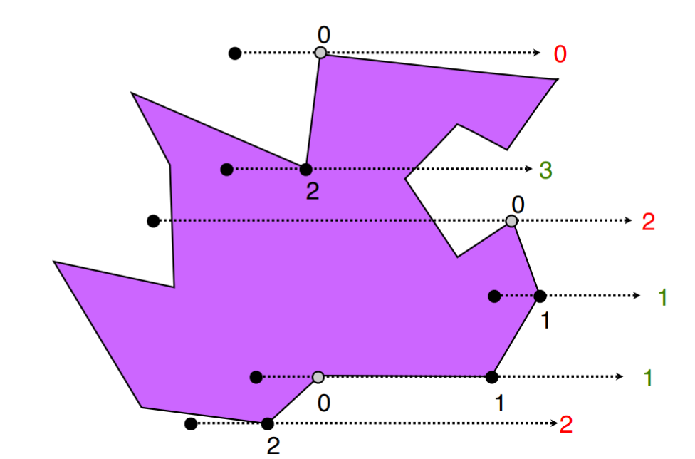

Reference: [Computational Geometry in C,P'Rourke](htts://cs.smith.edu/~orourke/books/compgeom.html)

## Shaders


#### Vertex shaders

Shaders are programs executed on the GPU for the purpose of rendering graphics written in GLSL (GL Shader Language). The GPU will execute the vertex shader for every vertex we supply it. That is saying, if we are drawing a triangle, the vertex shader will execute three times.

Stages may or may not include but at least one of them:

* Vertex Shaders (execute as many times as we supply, three times for drawing a triangle)
* Tessellation Control and Evaluation Shaders
* Geometry Shaders
* Fragment Shaders
* Compute Shaders 

```glsl
// Incoming vertex position
in vec2 position;

void main() {
    // gl_Position contains the position of the current vertex
    // Variables starting with 'gl_' are built-in and have special meaning
    gl_Position = vec4(position, 0, 1);
}
```

> OpenGL-Wiki: A shader is of purpose to execute one of the programming stages of the rendering pipeline. There are multiple stages each of which is specificed to its very own stage.

#### Fragment Shaders

The GPU will execute the fragment shader for every pixel it draws into the framebuffer. Fragment shaders is useful when drawing a color gradient effect because it requires drawing pixel-by-pixel in different color. That is saying, if we are drawing a triangle, the fragment shader will execute for every pixel that gets filled in.

The colors along the line through those points can be calulated by linear interpolation (*lerp*).

```glsl
out vec4 outputColor;

uniform vec3 input_color;   // if there is color being input

void main() {
    // Ouput black
    // The first three are RGB values
    outputColor = vec4(0, 0, 0, 0);
    // Output color with specific input color
    // outputColor = vec4(intput_color, 0);
}
```

Reference: [Vertex shaders vs Fragment shaders - stackoverflow](https://stackoverflow.com/questions/4421261/vertex-shader-vs-fragment-shader)

Reference: [Shader - opengl-wiki](https://www.khronos.org/opengl/wiki/Shader)

#### Using Sahders

To set the current shader in using: `gl.glUseProgram(shaderProgramID);`

#### GLSL Syntax

* NO printf (so no characters and etc)
* NO recursion
* NO double precison (this is where shaders might be failed, by zooming in for a while - see more details of the graphics - gl would not be able to keep the precision.)
* YES to supporting of matrices (vec2/vec3/vec4) of float type
* `in` and `out` implying input and output respectively
* `uniform` are inputs to the shader that are the same for every vertex (like global variables in C) adn are read-only
* `gl_Position` is a homogenous point in 3D (acutally the point in CVV coordinates, and that's the last userland operation, the following operations are OpenGL internal implementation)
* `outputColor` is a homogenous point in 3D, the first three components are the RGB values.

---

# Week 3 - B

## 3D Coordinates Introduction

3D coordindate systems can be left  or right handed (right-handed is preferred here while left-handed is used when applying negation).

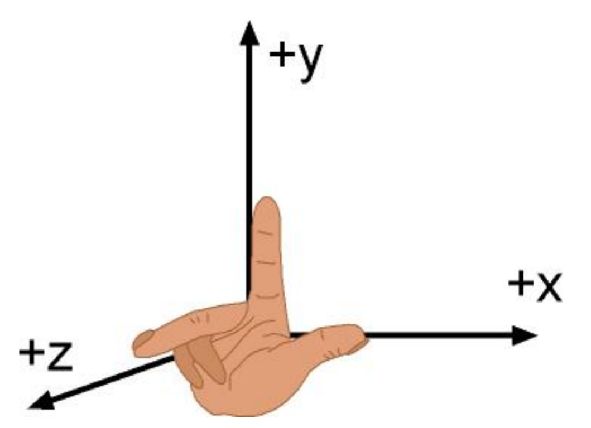

Comparing 2D scenes, there are two new problems (parameters) to be introduced:

* Depth and,
* Projection

## Depth

* OpenGL draws objects in the order in which they are generated in the code by default
  * Example:
  
    ```java
    // both have origin in (0, 0)
    new Polygon2D(-0.5, -0.5, 0.5, -0.5, 
            0.5, 0.5, -0.5, 0.5).draw(gl, frame);
    new Circle2D(0.5).draw(gl, frame);
    // result in circle overlaps square (polygon)
    ```
    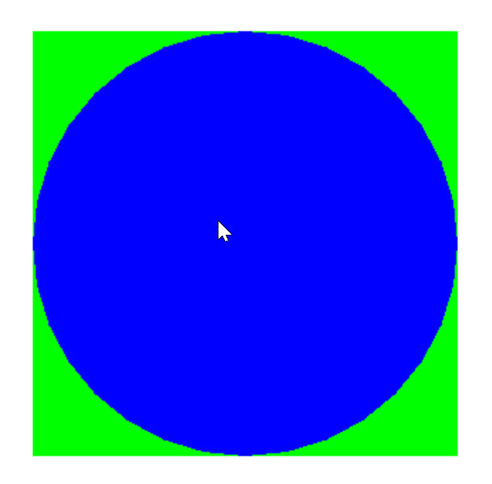

    * However, within 3D scene objects, it is difficult to decide the exact order for each of them.
* OpenGL also has similar implementation for 3D scenes but with more complex mechanism - drawing with depth.


## 3D Transformations

* 3D affine transformation has the similar structure as 2D but one dimension (axis)

$$ M = 
\begin{pmatrix}
    i_1 & j_1 & k_1 & \phi_1 \\
    i_2 & j_2 & k_2 & \phi_2 \\
    i_3 & j_3 & k_3 & \phi_3 \\
    0 & 0 & 0 & 1
\end{pmatrix} $$

#### Translation

$$ M_T =
\begin{pmatrix}
    1 & 0 & 0 & \phi_1 \\
    0 & 1 & 0 & \phi_2 \\
    0 & 0 & 1 & \phi_3 \\
    0 & 0 & 0 & 1
\end{pmatrix}
$$

#### Scale

$$ M_S =
\begin{pmatrix}
    s_x & 0 & 0 & 0 \\
    0 & s_y & 0 & 0 \\
    0 & 0 & s_z & 0 \\
    0 & 0 & 0 & 1
\end{pmatrix}
$$

#### Shear

$$ M_H = 
\begin{pmatrix}
    1 & h & 0 & 0 \\
    0 & 1 & 0 & 0 \\
    0 & 0 & 1 & 0 \\
    0 & 0 & 0 & 1 
\end{pmatrix}
$$

#### 3D Rotation

The rotation matrix depends on the **axis of rotation**. Hence, we will have three different decomposed rotations along each different axis.

Potisitive rotation is CCW from the next towards the previous axis (recall right-handed rule, thumb points rotation centre).

> This works no matter whether the frame is left or right handed. <br>
> Left hand rule is working **FOR A LEFT-HANDED COORDINATE SYSTEM**

* Mx rotates y towards z
* My rotates z towards x
* Mz rotates x towards y

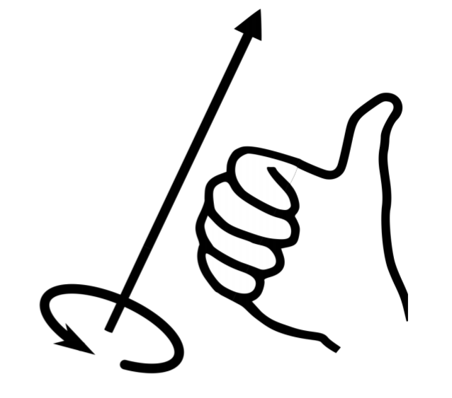

Finally, we have,

$$ M_x = 
\begin{pmatrix}
    1 & 0 & 0 & 0 \\
    0 & cos(\theta) & -sin(\theta) & 0 \\
    0 & sin(\theta) & cos(\theta) & 0 \\
    0 & 0 & 0 & 1
\end{pmatrix}
\\[10px]
M_y =
\begin{pmatrix}
    cos(\theta) & 0 & sin(\theta) & 0 \\
    0 & 1 & 0 & 0 \\
    -sin(\theta) & 0 & cos(\theta) & 0 \\
    0 & 0 & 0 & 1 
\end{pmatrix}
\\[10px]
M_z = 
\begin{pmatrix}
    cos(\theta) & -sin(\theta) & 0 & 0 \\
    sin(\theta) & cos(\theta) & 0 & 0 \\
    0 & 0 & 1 & 0 \\
    0 & 0 & 0 & 1 
\end{pmatrix}
$$

where $cos(\theta)$ and $sin(\theta)$ are depetermined by the *n*th row and *n*th column except $M_y$. Example: $M_x$ column 0 and row 0 are full of zeros and (0, 0) is 1.

#### 3D Transformations Implementation

Comparing to the 2D transformations, 3D transformations are now having effect in three dimensions,

```java
public class CoordFrame3D {
    public CoordFrame3D translate(float x, float y, float z) {...}
    public CoordFrame3D rotateX(float degrees) {...}
    public CoordFrame3D rotateY(float degrees) {...}
    public CoordFrame3D rotateZ(float degrees) {...}
    public CoordFrame3D scale(float x, float y, float z) {...}
}
```

## Winding Order

Objects have faces in OpenGL. Take triangles as example. Counter-clockwise (abbv. CCW in OpenGL) vertices are defined as their front face, while the clockwise (CW) vertices are defined as their back face.


#### Optimasation - Back face culling

Since it would consume a lot of memory for a GPU and a CPU that trying to render every fragments (or pixels) into the window, OpenGL instead will only render visible face (culling non-visible faces) before **ratserisation**

> What if there are two persons watching the very same object that needs backface culling to be disabled?

```java
// Back is disabled by default
gl.glEnable(GL2.GL_CULL_FACE);
```

## The view volume

* 2D cameras shows 2D world window, while 3D cameras shows 3D view volume
* This is the area of space that will be displayed in the viewport
* Objects outside the view volume are clipped
* The view volume is in camera coordinates

> The viewer can't see the entire 3D world, only the part taht fits into the *viewport*, which is the rectangular region of the screen or other display device where the image will be drawn. We say that the scene is "*clipped*" by the edgeds of the view port. <br>
> In OpenGL, the viewer can only see a limited ranger of z-values in the eye coordindate system. Points with larger or smaller z-values are clipped away and are not rendered into the image.

## Projection

Most of the 3D images we have seen are essentially 2D.

* Project a point from our 3D view volume onto the near plane, which will then be mapped to the view port
* Projection happens after the model and view transformations have been applied, so all points are in camera coordinates.
* Points with negative z values in camera coordinates are in front of the camera (recall 3D coordinate frame)

---
#### Depth

We still need depth information attached to each port so that later when we can work out which points are in front. The projection matrix maps z values of visible points between -1 for near plane and 1 for far plane.

#### Foreshortening

Foreshortening is the name for the experience of things appearing smaller as they get further away (because of the pupil and retina).

#### Clipping

Clipping is a method to seletively enable or disable rendering operations within a defined region of interest. A rendering algorithm only draws pixels in the intersection between the clip region and the scene model.

---

* Orthographic projection

    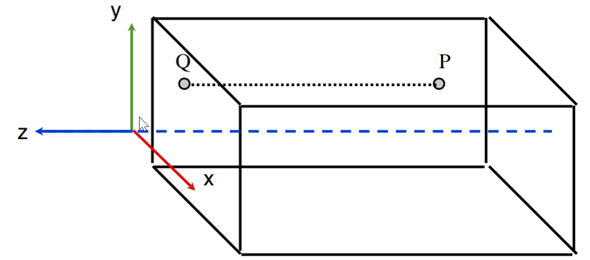
  * Depth: $q_x = p_x \\ q_y = p_y$
  * The depth formula above shows that there is no difference between an object in near plane and an object in far plane (i.e., not performing foreshortening)
  * Object size is independent of distance from the camera.
  * Camera is located at the origin in camera co-coordinates and oriented down the negative z-axis
  * Using a value of 2 for near means to place the near plane at z = -2
  * Similarly far = 8 would place it at z = -8
  * Orthographic transformation matrix maps the points in camera/eye coordinates into clipping coordinates
  $$ M_o = 
    \begin{pmatrix}
        \frac{2}{r-l} & 0 & 0 & -\frac{r+l}{r-l} \\
        0 & \frac{2}{t-b} & 0 & -\frac{t+b}{t-b} \\
        0 & 0 & \frac{-2}{f-n} & -\frac{f+n}{f-n} \\
        0 & 0 & 0 & 1
    \end{pmatrix}
  $$
  * Common used scenario: to maintain the parallel lines and describe shapes of objects completely and exactly

> More definition: <br>
> Orthographic projection is a means of representing three-dimensional objects in two dimensions. It is a form of parallel projection, in which all the projection lines are orthogonal to the projection plane, resulting in every plane of the scene appearing affine transformation on the viewing surface.

## View volume

* View volume is used for:
  * Clipping objects which will not project onto the image
  * Restricting the domain of z for visibilitu calculations

* Canonical view volume (CVV)

    
  * It is convenient for clipping if we scale all coordinates so that visble points lie within the range (-1, 1). And z axis are flipped - left handed system

* Perspective view volume (or **frustum**)

    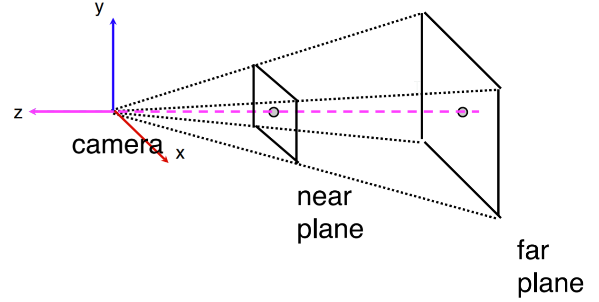

    * Boundaries sometimes can be hard to derterimined. So, instead of
    ```java
    public static Matrix4 frustum(float left, float right, 
            float bottom, float top, float near, float far) {...}
    ```
    we do
    ```java
    public static Matrix4 perspective(float fovy,
            float aspectRatio, float near, float far) {...}
    ```
    where `float fovy` is the field of view y-axis - vertical angle of the camera's lens, `float aspectRatio` is $\frac{width}{height}$

    

    * The perspetice projection: since it is projection, we can construct two similar triangles either along x-axis or y-axis, so we have

    $$ \frac{p_y}{p_z} = \frac{q_y}{-n} \ \&\  \frac{p_x}{p_z} = \frac{q_x}{-n} $$
    After rearragement, we have,
    $$ q_x = -n \frac{p_x}{p_z} \\[5px] q_y = -n \frac{p_y}{p_z} $$

## Pseudodepth

Depth is still required to determine which points are in front. And this information should be clampped between -1 and 1. Pseudodepth preserves front-to-back ordering.

These constraints yield an equation for pseudodepth:

<!-- TODO: Understanding of this equation -->
$$ q_z = \frac{ap_z + b}{-p_z} \\[5px] a = -\frac{f+n}{f-n} \\[5px] b = \frac{-2fn}{f-n} $$


One thing about pseudodepth is that is rather curved than linear, more precision for objects closer to the near plane, while rounding errors worse towards far plane. <br>
Avoid setting near and far needlessly small/big for better use of precision.

**Fun Fact: The reason why the depth buffer is non-linar is that make things more efficient (approximation for the object in the far plane objects). Differentiating depth between close objects is more important than differentiating depth between far objects.**

## Homogeneous coordinates

The fourth component are now no longer concontrainting to 0 and 1 but any numbers other than just zero and one. Hence, we have,
$$ P =
\begin{pmatrix}
p_x \\ p_y \\ p_z \\ 1 \end{pmatrix}
\equiv
\begin{pmatrix}
wp_x \\ wp_y \\ wp_z \\ w \end{pmatrix}
\text{for any $w \ne 0$} $$

There two vectors are representing the same point. So to speak, (1, 3, -2, 1) is equivalent to (2, 6, -4, 2) in homogeneous coordinates. <br>
Meanwhile,

$$ \begin{pmatrix}
1 & 0 & 0 & 0 \\
0 & 1 & 0 & 0 \\
0 & 0 & 1 & 0 \\
0 & 0 & 1 & 0 \end{pmatrix}
\begin{pmatrix}
12 \\ 6 \\ 3 \\ 1 \end{pmatrix}
= \begin{pmatrix}
12 \\ 6 \\ 3 \\ 3 \end{pmatrix}
\equiv \begin{pmatrix}
4 \\ 2 \\ 1 \\ 1 \end{pmatrix}
$$

> `W` component in the transformation matrix affects the scale, so the projection matrix just changes the `W` value based on `Z` value. <br>
> Later, we want to perform perspective division for converting the homogeneous coordinate back to `W = 1`

#### Perspective transform

Perspective equations can now be expressed as a single matrix:

$$ M_{perspective} = 
\begin{pmatrix}
n & 0 & 0 & 0 \\
0 & n & 0 & 0 \\
0 & 0 & a & b \\
0 & 9 & -1 & 0 \end{pmatrix}
\\[2px] \text{which apparently is a not affine transformation}
$$

* To transform a point:

$$ q = M_{perspective}P \\[2ex]
= \begin{pmatrix}
n & 0 & 0 & 0 \\
0 & n & 0 & 0 \\
0 & 0 & a & b \\
0 & 0 & -1 & 0 \end{pmatrix}
\begin{pmatrix}
p_x \\ p_y \\ p_z \\ 1
\end{pmatrix} \\[2ex]
= \begin{pmatrix}
np_x \\ np_y \\ ap_z + b \\ -p_z \end{pmatrix}
\equiv \begin{pmatrix}
-np_x/p_z \\ -np_y/p_z \\ -(ap_z+b)/p_z \\ 1
\end{pmatrix}
$$

* We combine perspective transformation and scaling into a single matrix to map it into the canonical view volume for clipping.

$$ M_p = 
\begin{pmatrix}
\frac{2n}{r-l} & 0 & \frac{r+l}{r-l} & 0 \\
0 & \frac{2n}{t-b} & \frac{t+b}{t-b} & 0 \\
0 & 0 & \frac{-(f+n)}{f-n} & \frac{-2fn}{f-n} \\
0 & 0 & -1 & 0
\end{pmatrix}
$$

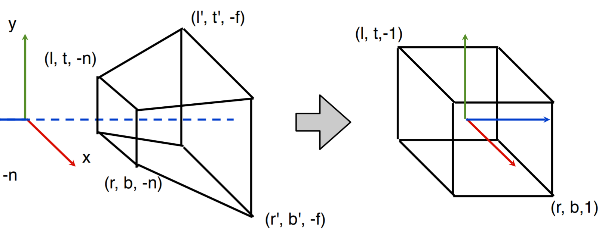

* Perspective divison step (normalise device coordinates)

**Canonical View Volume Coordinate is not a homogenous coordinate, to normalize it as a homogenous coordinate, we apply the division step to remove the $w$ from the fourth component**

$$ Q = \frac{1}{w}\begin{pmatrix}
p_x \\ p_y \\ p_z \\ w \end{pmatrix} \\[2px]
= \begin{pmatrix}
p_x/w \\ p_y/w \\ p_z/w \\ 1 \end{pmatrix}
$$

* Viewport transformation
    * Points are scaled into window coordinates corresponding to pixels on the screen
    * Also maps pseudodepth from [-1, 1] to [0, 1]

$$ M_{viewport} = \begin{pmatrix}
w_s/2 & 0 & 0 & s_x + w_s/2 \\
0 & h_2/2 & 0 & s_y + h_s/2 \\
0 & 0 & 1/2 & 1/2 \\
0 & 0 & 0 & 1 \end{pmatrix}
$$


## Transformation pipeline

* Transoformation pipeline
  * Transform a point in 3D: 
  $$ P = (p_x,p_y,p_z)^T $$
  * Extend to homogeneous coordinates: 
  $$ P = (p_x,p_y,p_z,1)^T $$
  * World matrix can be obtained by model matrix:
  $$ P_w = M_{model}P $$
  * Camera matrix can be obtained by camera matrix:
  $$ P_c = M_{view}P_w $$
  * CVV coordinates can be obtained by project matrix:
  $$ P_{cvv} = M_PP_c $$
  * Clip to remove points outside CVV
  * Perspective division to eliminate fourth component:
  $$ P_n = \frac{1}{p_w}P_{cvv} $$
  * Viewport transformation to window coordinates:
  $$ P_v = M_{viewport}P_n $$
  * `gl_Position` is the point int CVV coordinates

## Cameras in 3D world

* Similarity: the view transform is the world-to-camera transform, which is the inverse of the usual local-to-global transformation for objects
* Differential: the camera does not have an aspect ratio, this is handled by the projection transform
* **The camera points backwards down the local z-axis**

#### Fragments

* Rasteration converts triangles into collections of fragments.
* Culled triangles are discarded and not converted into fragments
* A fragment may not make it to the final iamge if it is discarded by depth testing

## Hidden surface removal

1. Make sure all triangles (and therefore fragments) are drawn in the correct order in terms of depth (model level/macro).
2. Use the depth buffer (fragment level/micro).

#### Painter's algorithm

```
- Sort geometric primitives by depth
- Draw in order form back to front (last draw with higher prioirty)
```

However, there are certain images are difficult to apply this naive method.

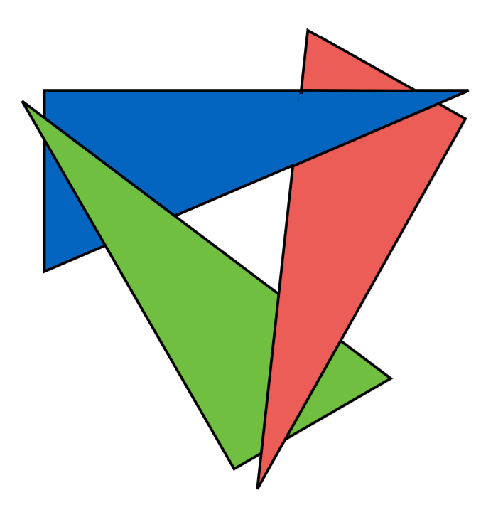

> Painter's algorithm can still be applied here but less efficient. <br>
> Cut down to mulitple polygons

#### BSP Trees (Binary Space Partitioning trees)

Recursively, divide the world into polygons that are behind or in front of other polygons and split polygons when necessary.

Then traverse and draw polygons in a front to back order.

However, it does certain shorthands, building the tree is slow and it needs to be rebuilt every time the geometry changes.

Best for rendering static geometry where tree can just be loaded in.

#### Depth buffer

Keep per-pixel depth information stored in a block of memory called the depth buffer (or z-buffer).

```java
    // d[x][y] = pseudodepth of pixel (x,y)

    // in init
    gl.glEnable(GL2.GL_DEPTH_TEST);

    // in display
    gl.glClear(
            GL.GL_COLOR_BUFFER_BIT |
            GL.GL_DEPTH_BUFFER_BIT); 
 ```

 Each depth buffer is initialised to 1 and each polygon is drawn fragment by fragment. Each fragment has its pseudodepth compared to the value in the depth buffer.

Bascially, it is keeping record of least pseudodepth for depth buffer and updating when new iamge comes.

 ```java
 Initialise db[x][y] = 1 for all x,y

 For each triangle:
    For each fragment (px,py):
        d = pseudodepth of (px,py)

        if (d < db[px][py]):
            draw fragment
            db[x][y] = d
```

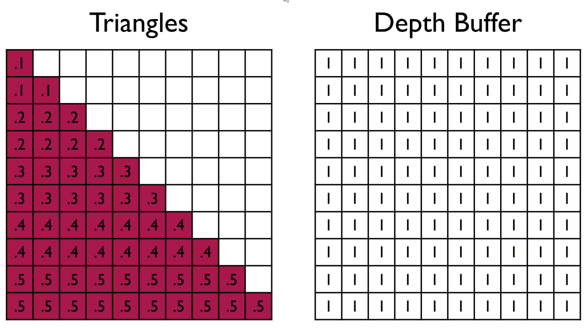
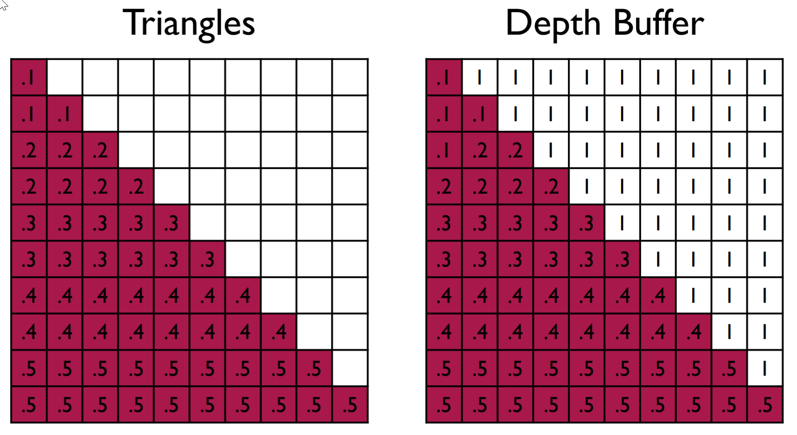
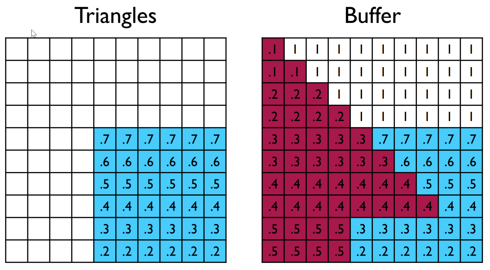

## Exercise

1. Given this local coordinate frame

    ```
    CoordFrame2D.identity()
            .translate(3,2)
            .rotate(-45)
            .scale(0.5,0.5);
    ```

    What point in the local coordinate frame would correspond to the world coordinate `Q (2,-1)`?

2. Using linear interpolation, what is the midpoint between `A = (4,9)` and `B = (3,7)`?

3. Calculate the view matrix given scene tree and camera transformation.

    1. Calculate the camera matrix according to the scene tree
    2. Get the gloabl translation accordingly as well as gloabl rotation and scale
    3. VIEW MATRIX = INVERSE_CAMERA_GLOBAL_SCALE * INVERSE_CAMERA_GLOABL_ROTATION * INVERSE_CAMERA_GLOAL_TRANSLATION

4. What happens if the field of view (FOVY) is changed to 90 degrees? 180 degrees? 240 degrees?

    As the FOV gets larger, the squares shrink towards the midddle of the screen. At 180 degrees, they disappear. A FOV greater than 180 degrees is nonsensical.