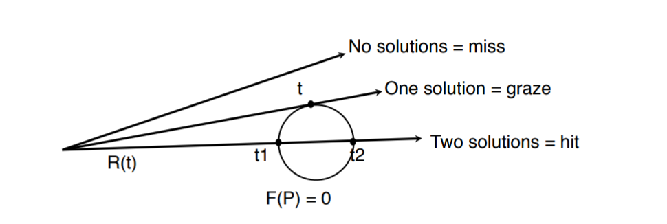
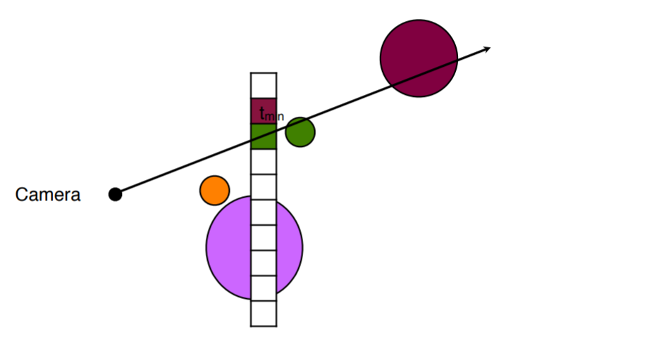
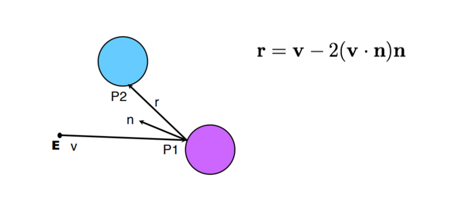
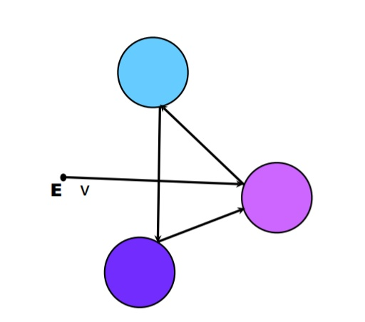
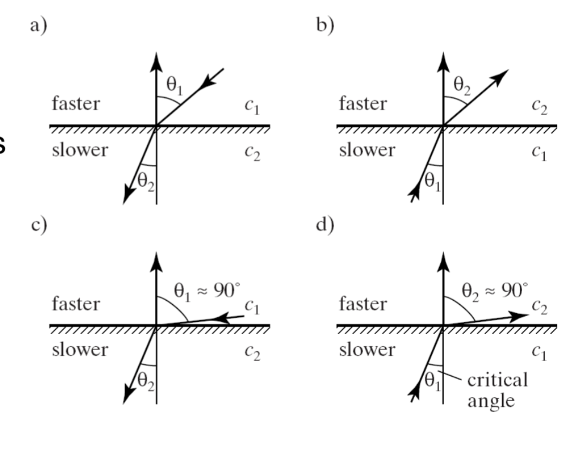
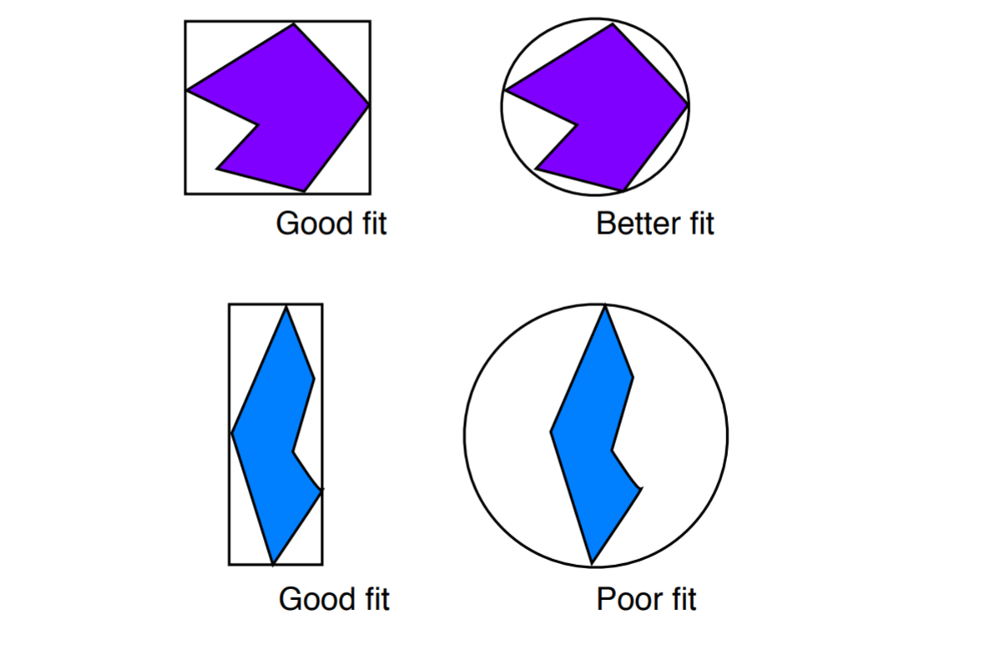
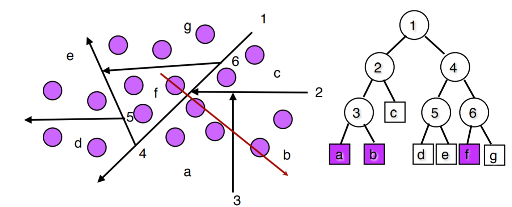
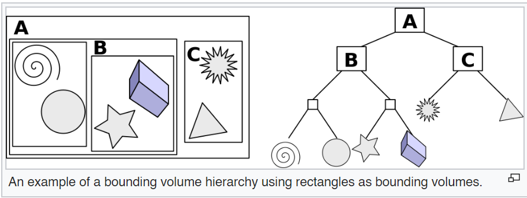

# Week 7A Particle Systems, Ray Tracing

## Particle systems

**Volumetric objects like fire, smoke and clouds are usually implemented as either *particle systems* or using *volumetric ray tracing***

Some visual phenomena (such as, raining, snowing, fire, smoke and dust) are best modelled as *collections of small particles*.

Particles are usually represented as small textured quads or point sprites - single vertices with an image attached. They are *billboarded*.

> Billboarded here means they are transformed so that they are always face towards the camera.

Particles are created by an emitter object and evolve over time, usually changing position, size and color.

#### Billboarding

An approximate form of billboarding can be achieved by having polygons face a plane perpendicular to the camera.

#### Point Sprites

The textured sprite will be rendered in `OpenGL` using `GL_POINTS`. Points have postion (translation obv.), but no rotation nor scale (as it is a point after all), so are implicitly billboarded. The size of points can be set with `gl.glPointSize(int)`

## Particle evolution

The rules for particle evolution are:

* Interpolate from one color to another over time
* Move with constant speed or acceleration.

Since the equation involves the floating points calculation, to simulate many particles, it is important these updates steps are simple and fast.

#### Particles on the GPU

Particles systems are well suited to implementation as **vertex shaders**, where the particles can be represented as individual vertices. Moreover, a vertex shader can compute the position of each particle at each moment in time (obviously, particle system does not have to be fragements).

## Global lighting

The lighting we previously encountered only handled **direct lighting** from sources:

$$ I = I_a\rho_a + \sum_{l \in \text{lights}} I_l \Big(\rho_d(\hat{\textbf{s}_1} \cdot \hat{\textbf{m}}) + \rho_{sp} (\hat{\textbf{r}_1} \cdot \hat{\textbf{v}})^f \Big) $$

> Illumination = Ambient Light + Multiple_Light_Source (Diffuse Lihgt + Specular Light)

We added an ambient fudge term to account for all other light in the scene, without which surfaces might not be facing a light source are black (add more detail to the back face towards the light).

In reality, the light falling on a surface comes from everywhere. Light from one surface is reflected onto another surfaces and then another, an another and over and over again. The methods that take this kind of multi-bounce lighting into account are called **global lighting** methods.

#### Global lighting methods

There are two main methods for **global lighting**:

1. Raytracing: models **specular** reflection and refraction.
2. Radiosity: models **diffuse** reflection.

> Both methods are **computationally expensive** and are rarely suiable for real-time rendering.

[Unreal Engine](https://www.unrealengine.com/en-US)

## Ray tracing

**Ray-tracing is relatively slow and can only be done in real time on very high-end machines. For every pixel in the rendered image a ray is cast from the object hit towards each light sources in turn to decide whether the source is occluded or not. This avoids the quality problems created by the shadow buffer, but it much more computationally expensive. The advantage is that it can take into account reflected and refracted light and so produces much more realistic lighting. Nevertheless the shadow edges are still typically hard.**

Basic idea: Divide the screen into all pixels into the near clipping plane, and given a pixel, firing a ray from the camera through the pixel hitting the object, and fianlly assign the color for the pixel based on what color the ray is hitting on.

Ray tracing is a different approach to rendering than the pipeline (In the `OpenGL` pipeline we model objects as meshes of polygons which we convert into fragments and then display or not). On the contrary, in ray tracing, we model objects as *implicit forms* and compute each pixel by casting a ray and seeing which models it intersects.

#### Particle systems vs. Ray-tracing

* A particle system represents the volume as a collection of moving particles. A volumetric system represents the volume as a grid of cells with varying density.
* Particle systems are easier to implment in polygon-rendering systems like OpenGL as they can be represented simply as collections of quads or point sprites, which are generally supported with little extra coding. Grid based representations will require more specific ray-marching code to be written, On the other hand, grid-based representations are easier to implement in ray-tracing systems, where particles require lots of individual collections to be calculated.

#### Projective Methods vs. Raytracing

* Projective Methods:
  * **Projective method maps the whole object into several fragments of the projection plane.**
  * Multi-pixels - multi-fragments
  * For each **object** (might occupy multiple pixels): Find and update each pixel it influences
* Ray Tracing:
  * **Ray tracing maps each pixel of the object into a single fragment of the projection plane.**
  * Single-pixel - single-fragment
  * For each **pixel**: Find each object that influences it and update accordingly


#### Similarity and differecne

* They share lots of techniques:
  * Shading models
  * Calculation of intersections
* They also have tons of differences:
  * Projection and hidden surface removal come for 'free' in ray tracing

#### Ray tracing demonstration


> ***For each pixels***


#### Locations of Pixels

Question: Where on the near plane does a given pixel (x,y) appear?


$$ \text{pixel width} = \frac{2w}{c} \\[2ex]
\begin{aligned}
\text{i}_c &= -w + x\big( \frac{2w}{c} \big) \\
    &= w \big( \frac{2x}{c} - 1 \big)
\end{aligned} \\[2ex]
\text{pixel height} = \frac{2h}{r} \\[2ex]
\text{j}_r = h\big(\frac{2y}{r} - 1 \big)
$$

where,
* $c$ is the number of columns
* $r$ is the number of rows
* $x$, $y$ differ from the traditional coordinate system, they are actually the (x,y) pixel from the near plane.
* $i_c$ is the coordinate value in near plane along the horizontal axis
* $j_r$ is the coordinate value in near plane along the vertical axis

#### Rays

The vector composited of the point P(x,y) of pixel (x,y) is given by:

$$ P(x,y) = E + i_c \textbf{i} + j_r \textbf{j} - n \textbf{k} $$

where,

* $E$ is the location of the camera
* $n$ is the how far the near plane is relative to the camera

A ray from the camera through P(x,y) is given by:

$$ \begin{aligned}
R(t) &= E + t(P(x,y) - E) \\
    &= E + t\textbf{v} \\
v &= i_c \textbf{i} + j_r \textbf{j} - n \textbf{k}
\end{aligned}
$$

When:
* $t=0$, we get E (Eye/Camera)
* $t=1$, we get P(x,y) - the point on the near plane - $E + \textbf{v}$
* $t>1$, point in the world
* $t<0$, point behind the camera - not on the ray, $E - k, k \in P$

## Intersections

Now, to determine which the color the pixel shall be assigned to, we want to compute where this ray intersects with the objects in the scene.

For basic shapes, we can do this with the equation of the shape in **implicit form**:

$$ F(x,y,z) = 0 $$

which can also be writen as:

$$ F(P) = 0 $$

General idea is to substitutue the formula for the ray into $F$ and solve for $t$

#### Intersecting a unit sphere at the origin

$$ F(x,y,z) = x^2 + y^2 + z^2 - 1 = 0 \\[1ex]
OR \\[1ex]
F(P) = |P|^2 - 1 = 0 $$

#### Intersecting a generic sphere

$$ \begin{aligned}
F(R(t)) &= 0 \\
|R(t)|^2 - 1 &= 0 \\ 
|\textbf{E} + \textbf{v}t|^2 -1 &= 0 \\
|\textbf{v}|^2t^2 + 2(\textbf{E}\cdot \textbf{v})t + (|\textbf{E|}^2-1) &= 0
\end{aligned}
$$

As the equation is quadratic, it is possible to get zero, one or two solutions:



> **Graze does not account for the hit**

#### Intersecting a generic plane

> **Only the z-coordinate value matters**

The x-y plane has implicit form:

$$ \begin{aligned}
F(x,y,z) = z &= 0 \\
F(P) = p_z &= 0
\end{aligned} $$

Intersecting with the ray:

$$ \begin{aligned}
F(R(t)) &= 0 \\
\textbf{E}_z + t \textbf{v}_z &= 0 \\
t &= -\frac{\textbf{E}_z}{\textbf{v}_z}
\end{aligned} $$

#### Intersecting a generic cube

To compute the intersections with the generic cube, we first apply the `Cyrus-Beck clipping algorithm` with the algorithm extended to 3D. The algorithm can be used to compute intersection with arbitrary convex polyhedral and meshes of convex faces.

#### Intersecting a non-generic solids

The general idea to avoid writing special-purpose code to calculate intersections with non-generic spheres, boxes, planes, etc.

Instead, we can transform the ray and test it against the generic version of the shape.

## Transformed spheres

We can transform a sphere by applying *affine transformations*. Let P be a point on the generic sphere. We can then create an arbitrary ellipsoid by transforming P to a new coordinate frame given by a matrix M.

#### 2D Example


$$ \begin{aligned}
F(P) &= 0 \\
F(\textbf{M}^{-1}Q) &= 0 \\
Q &= \textbf{M}P
\end{aligned} $$

So in general if we apply a coordinate transformation **M** to a general solid with implicit equation F(P) = 0, we get:

$$ \begin{aligned}
F(\textbf{M}^{-1}Q) &= 0 \\
F(\textbf{M}^{-1}R(t)) &= 0 \\
F(\textbf{M}^{-1}E + t\textbf{M}^{-1}\textbf{v}) &= 0
\end{aligned} $$

> * Hence, it is really applying inverse transformation to the ray.
> * Do standard intersection with the generic form of the object
> * Affine transformations preserve relative distances so values of $t$ will be valid.

#### Pseudocode

```python
for each pixel (x,y):
    v = P(x,y) - E
    hits = {};
    for each object obj in the scene:
        E' = M^-1 * E
        v' = M^-1 * v
        hits.add(obj.hit(E', b'))
    hit = h in hits with min time > 1
    if hit is null:
        set (x,y) to background
    else:
        set (x,y) to hit.obj.color(R(hit.time))
```

#### 2D Example




## Shading and Texturing

When we know the object hit and the point at which the hit occurs, we can compute the **lighting equation** to get the illumination as well as the texture coordinates for the hit point to calculate its color.

By combining these, we are able to compute the pixel color.

<br><br><br>

---

# Week 7B Application of Ray Tracing

## Shadows

One simple approach is, at each hit point, we cast a new ray towards each light source. These rays are called *shadow feelers*.

If a shadow feeler intersects an object before it reaches the source, then omit that source from the illumination equation for the point.

#### Self-shadows

The shadow feeler will always intersect the hit object at time $t=0$ (as the hit point is on the object itself). This intersection is only relevant if the light is on the opposite side of the object.

#### Example


#### Pseudocode

```
Trace primary ray
if (hit is null)
    set (x,y) to background
else
    set (x,y) = ambient color
    Tracing secondary ray to each light
        if not blocked from light
            (x,y) += contribution from that light source
```

## Reflections

Realistic reflections can now be implemented by casting further reflected rays (ray tracing).



Reflected rays can in turn be reflected off another object and another. What needs to be **noted** here is that we usually write our code to stop after a fixed number of reflections to avoid infinite recursions.



> Mutiple number of bouncing reflection

## Transparency

We can also model transparent objects by casting a second ray that continues through the object (ray passing throug the transparent object)


Transparency can also be applied reflexively, yeilding a tree of rays.


## Illumination

**Illumination is then extended to include reflected and transmitted components**

The illumination equation is extended to include reflected and transmitted components, which are computed recursively:

$$ I(P) = I_{amb} + I_{dif} + I_{spe} + I(P_{ref}) + I(P_{tra}) $$

where reflection and transparency are computed recursively. Yet, we still need material coefficients to attenuate the reflected and transimitted components appropriately.

## Refraction of Light

When a light ray strikes a transparent object, a portion of the ray penrtrates the object. The ray will change direction from the original direction (**dir**) to refracted direction (**t**) if the speed of light is different in medium 1 and medium 2. Vector **t** lies in the same plane as **dir** and the normal **m**.


#### Refraction contributes to transparency

To handle transparency appropriately we need to take into account the refraction of light. Light bends as it moves from one medium to another. The change is described by `Snell's Law`:

$$ \frac{sin\theta_1}{c_1} = \frac{sin\theta_2}{c_2} $$

where $c_1$ and $c_2$ are the speeds of the light in each medium

#### Refraction

By rearranaging the `Snell's Law`

$$ \frac{sin\theta_1}{c_1} = \frac{sin\theta_2}{c_2} \\[1ex]
\frac{c_1}{c_2} = \frac{sin\theta_1}{sin\theta_2} $$

As, $0 < \theta < 90$. Hence, if

* c1 > c2, so as to $\frac{c1}{c2} > 1$, $\frac{sin\theta_1}{sin\theta_2} > 1$
* c1 < c2, so as to $0 <\frac{c1}{c2} < 1$, $0 < \frac{sin\theta_1}{sin\theta_2} < 1$



* In (c) and (d), the larger angle has become nearly 90 degree. The smaller angle is near the critical angle: when the smaller angle (of the slower medium) gets large enough, it forces the larger angle to 90 degree. A larger value is impossible, so no light is transmitted into the second medium. This is called **total internal reflection**. Noted: this is where reflection happens instead of refraction.

#### Wavelength contributes to refraction

Different wavelengths of light move at different speeds (except in a vacuum). So for maximum realism, we should calculate different paths for different colors.

> Taking sunlight passing through a raindrop as example


To implement a transparent model, the exact way would be that trace separate rays for each of the color components, as they would refract in different directions. This would be expensive computationally, and would still provide only an approximation, because an accurate model of refraction should take into account a large number of colors, not just three three primaries (RGB).

However, there is one of the simplest approach is to model transparent objects so that their index of refraction does not depend on wavelength.

#### Optimisation

Testing collisions for more complex shapes (such as meshes) can be very time consuming. In a large scene, most rays will not hit the object, so performing multiple expensive collision tests is wasteful. Hence, we are required to find a fast way to rule out objects which will not make any difference to the scene (not be hit).

## Optimisation - Extents

> **Extents are bounding boxes or spheres which enclose an object that optimises the performance of testing collisions.**

**Reason**: Testing against a box or sphere is fast. If this test succeeds, then we proceed to test against the object. To keep the deviation as less as possible (minise false positive), we want tight fitting extents.

#### Examples



#### Computing extents

* To compute a **box extent** for a mesh we simply take the min and max for the `x`, `y` and `z` components over all the points.
* To compute a **sphere extent** we find the centroid of all the vertices by averaging their coordinates, This is the centre of the sphere. the radius is the distance to the vertex farthest from this point

#### Projection extents

> Few concepts:
> * Screen Space: The space defined by the screen.
> * World Space: The space in which your objects live.
> * The camera maps the world space into screen space.

Alternatively, we can build extents in screen space rather than world space.

A projection extent of an object is bounding box which encloses all the pixels which would be in the image of the object (ignoring occlusions). Pixels outside this box can ignore the object. Does not work for the shadow feelers or reflected rays.

We can compute a projection extent of a mesh by projecting all teh vertices into screen space and finding the min adn max `x` and `y` values.


## Optimisation - Binary Space Partitioning

Another approach to optimisation is to build a Binary Space Partitioning (BSP) tree dividing the world into cells, where each cell contains a small number of objects.


#### Traversing the tree

If a ray passing through, we do not want to traverse the entire tree. Instead, we only want to visit the leaves the ray passes through.



#### Traversal algorithm

```
visit(E, v, node): (E eye)
    if (node is leaf):
        intersect ray with objs in leaf
    else:
        if (E on left):
            visit(E, v, left)
            other = right
        else:
            visit(E, v, right)
            other = left
        endif

        if (ray crosses boundary):
            E' = intersect(E, v, boundary)
            visit(E', v, other)
        endif
    endif
```

## Scattering (NOT EXAMINABLE)

> Scattering (or subsurface scattering) is when light refracts into an object that is **non-uniform** in its density and is reflected out at a different angle and position.


Milk is a substance that has this property as well as skin, leaves and wax. Typically, they are hard to render.

[More in detail](http://graphics.ucsd.edu/~henrik/images/subsurf.html)

## What Raytracing Can't Do

Basic recursive raytracing cannot do:

* Light bouncing off a shiny surface like a mirror and illuminating a diffuse surface (infinite loop)
* Light bouncing off one diffuse surface to illuminate others
* Light transimitting then diffusing internally

Also a problem for rough specular reflection:

* Fuzzy reflections in roughy shiny objects

## Realtime ray-tracing (RTX)

> This is the recent Nvidia innovation supported via specialised hardware. Programss have to be written to use it, but it fits in quite well with existing graphics pipelines.

> Works by arranging objects in a bounding volume hierarchy (BVH), where specialised hardware offers fast traversal of these hierarchies to find ray intersections.

## Bounding Volume Hierarchy (BVH)

Scene is divided into small volumes. Child volumes are contained entirely within their parents. Sibiling volumes may overlap.



Parents can have an arbitrary number of children. The best way to divide up the scene depends on a lot of factors.

#### Top down construction

Divide the set of primitives in the scene into two (or more) subsets then recursively subdivide those until all subsets contain only one primitive.

Properties:

* Easy to implement
* Usually faster than alternatives
* Doesn't always produce the best possible tree
  
#### Bottom up construction

Treat all primitives in the scene as a set of leaves. Pick two (or more) of them and group them into a node. Repeat till there is only one node in the set.

Properties:

* Slower than top-down in most cases
* More difficult to implement
* Tends to produce better trees

## Volumetric ray tracing

We can also apply ray tracing to volumetric objects like smoke or fog or fire. Such objects are transparent but have different intensity and transparency throughout the volume.

We represent the volume as two functions:

$$ \begin{aligned}
    C(P) &= \text{color at point} P \\[2ex]
    \alpha(P) &= \text{transparency at point} P
\end{aligned} $$

Typically these are represented as values in a 3D array. Interpolation is used to find values at intermediate points. These functions may in turn be computed based on density, lighting or other phsical properties.

#### Sampling

We cast a ray from the camera through the volume and take samples at fixed intervals along the way.


We end up with (N+1) samples:

$$ \begin{aligned}
    P_i &= R(t_{hit} + i \Delta t) \\[2ex]
    C_i &= C(P_i) \\[2ex]
    \alpha_{i} &= \alpha(P_i) \\[2ex]
    C_N &= (r,g,b)_{background} \\[2ex]
    \alpha_{N} &= 1
\end{aligned} $$

#### Alpha compositing (Back-to-front)

We now combine these values into a single color by applying the alpha-blending equation.

$$ \begin{aligned}
    C_N^N &= C_N \\[2ex]
    C_N^i &= \alpha_{i} C_i + (1 - \alpha_{i}) C_N^{i+1}
\end{aligned} $$

where, 

* $C_N^i$ is the total color at $i$
* $\alpha_{i} C_i$ is the local color at $i$
* $C_N^{i+1}$ is the total color at $i+1$

We can write a closed formula for the color from `a` to `b` as:

$$ C_b^a = \sum_{i=a}^b \alpha_{i} C_i \prod_{j=a}^{i-1} (1 - \alpha_{j}) $$

#### Front-to-back Alpha Compositing

Additionally, we also can compute this function from **front to back**, stopping early if the transparency term gets **small enough** that nothing more can be seen.

#### Implementation in `OpenGL`

Volumetric ray tracing (AKA. ray casting) does not require a full ray tracing engine. It can be implemented in `OpenGl` as a fragment shader applied to a cube with a 3D texture.

[Clouds tutorial](https://www.shadertoy.com/view/XslGRr)

## Exercise

1. How does milk look different to white paint?

    Both are opaque and essentially pure white. But milk is an example of scattering.

2. Suppose we have a background color of (0,1,0) and a volume with the uniform color of (1,0.5,0.5). A ray cast through that volume takes two samples. The first has an alpha value of 0.2 and the seond 0.1. What is the color of the resulting pixel?

    Recall the previous graph from **Sampling**, the ray is passing through the volume from the camera to the background.

    

    $$ \text{Background Color}\ C_N = (0,1,0) \\[2ex]
    \text{Uniform Color of Volume}\ C_i = (1,0.5,0.5) \\[2ex]

    \alpha_{0} = 0.2 \\[2ex]
    \alpha_{1} = 0.1 \\[2ex]

    C_2^2 = (0,1,0) \\[2ex]
    C_2^1 = \alpha_{1} C_i + (1-\alpha_{1})C_2^2 \\[2ex]

    C_2^0 = \alpha_{0} C_i + (1-\alpha_{2})C_2^1 $$

3. What are some issues that may arise when implementing blending in OpenGL? What are some ways these issues can be overcome?

    Solutions:
        1. Draw all opaque objects first
        2. Sort all transparent objects.
        3. Draw all transparent objects in the sorted order.

4. What are BSP trees? Give one application for which they can be used? What problem do they solve in that application?

    BSP trees are data structures that are used to partition objects within a space. One area where they can be used is for ray tracing. When used in ray tracing, they allow us to avoid testing for ray-intersection with evry object in the scene. By dividing the scene up, we are able to only test against the objects in the subspaces that the ray travels through.

5. What kind of modelling techniques would you use to model the shape and surface of a shiny metal teapot for a real-time game?

    The shape of the teapot could be modelled using Bezier patches. Alternatively, the base and lid could be modeled as surfaces of revolution. The spout could possibly be modelled using extrusion. Assumeing we want the teapot to be a metalic surface we would model it as being highly specular. We could possibly use environment mapping to get reflections on the teapot. Since we are modelling this for a real-time game, we probably would not use ray-tracing techniques that would make the teapot look more realistic, we would be concerned about efficiency.

6. What techniques would you apply for rendering a scene with soft shadows and realistic diffuse lighting?

    The technique should be applied here is one of the global illumination approach - radisoity. The advantages of the approach is that it models indirect diffuse ligthing and as a result can render soft shadows and realistic diffuse lighting. The disadvantages of radiosity is that it does not handle translucent, transparent or specular surfaces in the calculations. It is calculation intensive and too slow for real-time applications. It can be used in real-time applications to pre-compute lighting for portions of geometry that are static and rendered offline into textures. However, pre-computed lighting is not suitable for dynamic lights or moving objects.